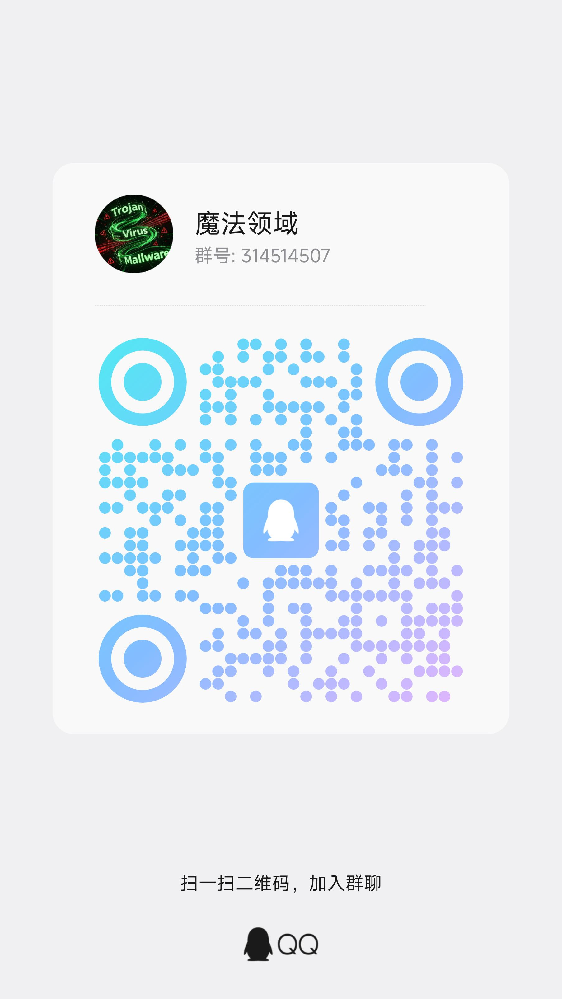

<div align="center">
  
  <h1 align="center">魔法推送</h1> 
  <span>
    <a href="https://github.com/magiccode1412/magicpush" target="_blank">项目地址</a> | 
    <a href="docs/CHANGELOG.md">更新日志</a>
  </span>
  <p>一个支持多种消息渠道的推送服务管理平台，用户可以通过标准化的REST API接口将消息推送到多种通知渠道。</p>
  <p>
    <a href="./LICENSE">
      
    </a>
    <a href="./version.json">
      
    </a>
    <a href="https://hub.docker.com/r/magiccode1412/magicpush" target="_blank">
      
    </a>
    <a href="https://hub.docker.com/r/magiccode1412/magicpush" target="_blank">
      
    </a>
  </p>
</div>

## 使用交流

<table>
  <tr>
    <td align="center">
      <a href="https://qm.qq.com/q/wWS78gByRa">点此加入QQ群</a>
      <br>
      
    </td>
    <td align="center">
      <a href="https://pd.qq.com/s/eveskv89x">点此加入QQ频道</a>
      <br>
      
    </td>
  </tr>
</table>

## 文档

+ [关键词过滤](docs/documentation/keyword-filter-guide.md)
+ [消息免打扰](docs/documentation/do-not-disturb-guide.md)
+ [入站配置](docs/documentation/inbound-config-guide.md)

## 🌐 [Demo站](https://uptimeflare-ept.pages.dev/)

自行注册即可（邮箱可随便填，不需要验证）

由于zeabur和clawcloud run不再提供免费资源，所以demo站转到railway和huggingface

> 演示环境仅作测试使用，请勿发送违规信息
>
> 切勿使用真实个人信息，数据会定期重置，请勿存储重要信息。
>
> 演示环境部署在railway和huggingface，如果遇到无法访问，可能是在冷启动中

## 预览

<details>
  <summary>点击查看预览图</summary>
  <div>
    
    
    
    
    
    <!-- 
    
    
    
    
    
    
    
    
     -->
  </div>
</details>

## 困境

市面上有很多消息推送服务,但是各个各的局限,例如:
  + Telegram ➡️ 最优秀的消息推送服务,但是需要魔法
  + 企业微信/钉钉/飞书 ➡️ 消息仅限于企业内部
  + 微信服务号 ➡️ 模板消息限制太多
  + 微信龙虾机器人 ➡️ 支持直接推送到个人微信，但有10条/24小时限制

也有一些开发者,开始转向App推送,更甚者,开始支持手机系统底层推送,例如:
+ pushplus: 支持多渠道推送,包括微信服务号/App/webhook
+ wxpusher: 支持多种手机的系统级推送,不需要App运行

其实市面上的推送服务基本都覆盖到了(**除了万恶之首的微信**),但是我们必须考虑如果作为中转的第三方推送服务宕机了,或者说不玩了,会有什么后端,得更新所有的调用代码/令牌

通过以下几张图,就会明白,自己拥有一个推送服务,是多么的有用:
+ 一对一的消息推送方式


+ 多对一推送服务


+ 使用自己的推送服务


## ✨ 功能特性

### 消息渠道支持
- **微信龙虾机器人** (扫码绑定，直接推送到个人微信，有10条/24小时限制)
- **元宝 Bot** (WebSocket绑定，支持私聊/群聊消息推送)
- **企业微信机器人**
- **Telegram Bot**
- **PushPlus**
- **WxPusher**
- **飞书机器人**
- **钉钉机器人**
- **微信公众号** (模板消息推送，支持测试号)
- **Server酱** (微信推送服务)
- **Webhook** (通用 HTTP 推送，支持自定义 URL/Headers/Body)
- **SMTP邮件** (支持QQ邮箱、163邮箱、Gmail等)
- **Gotify** (开源自托管推送服务)
- **Bark** (iOS 自定义推送通知)
- **Meow** (鸿蒙系统推送应用)
- **PushMe** (多平台统一推送服务)
- **息知** (极简微信消息通知接口，永久免费，支持单点推送和频道推送)
- **企业微信应用** (企业微信应用消息推送)
- **ntfy** (开源跨平台推送服务，支持自托管)
- **PushDeer** (全平台推送服务，支持 iOS/Android/Mac，**项目已停止维护**)
- **iGot** (开放式通知推送服务，支持 iOS/Android)
- **群晖 Chat** (Synology NAS 即时通讯套件，通过 Incoming Webhook 推送)
- **ShowDoc** (在线文档/知识库推送，支持 Markdown 和 HTML，一键式推送 URL)

### 核心功能
- 多渠道消息同时推送
- 标准化REST API
- 双令牌JWT认证机制 (access/refresh token)
- 用户注册/登录
- 渠道绑定与配置管理
- 推送接口管理（多接口/多令牌）
- **推送消息关键词过滤**（支持黑名单/白名单模式，按接口独立配置）
- **消息免打扰（DND）**（支持按接口配置多个免打扰时段，全局开关控制）
- 推送历史记录与状态追踪（含接口名称标识）
- 响应式Web管理界面
- 深浅色主题切换

### 安全防护
- **三层限流防护**
  - Nginx 层：IP 级请求频率限制 + 并发连接控制（兜底保护）
  - Express 全局：按 IP 限制每分钟总请求数
  - Express 接口级：针对登录、注册、推送、入站等接口独立限流
- **全局限流开关**：管理员可在前端「安全设置」页面一键启用/禁用所有限流规则（默认开启）
- **动态限流配置**：管理员可在前端「安全设置」页面实时调整所有限流额度，修改立即生效，无需重启服务
- **推送接口双重限流**：同时按来源 IP 和推送 Token 限流，防止 Token 泄露后被滥用
- 限流触发时自动记录日志，方便排查异常请求

> **注意：** 预构建的 Docker 镜像（`magiccode1412/magicpush:latest`）为 All-in-One 模式（Express 直接提供静态文件），不包含 Nginx，因此仅具备 Express 层的两层限流。如需启用 Nginx 层的兜底限流，请使用 `docker-compose up -d` 自行构建前后端分离镜像。

## ⚠️ 各渠道消息发送频率限制

本项目对各推送接口有默认的限流策略（可在管理后台「安全设置」中动态调整），同时各消息渠道平台自身也有频率限制，配置时需注意：

| 渠道 | 平台频率限制 | 限制维度 | 说明 |
|------|-------------|---------|------|
| **企业微信群机器人** | 20 条/分钟 | 每个 Webhook | 官方文档明确标注，超限返回错误码 |
| **企业微信应用** | ~200 次/分钟 | 每个应用 | 与接收人数相关 |
| **Telegram Bot** | 1 条/秒（同群）<br>30 条/秒（不同群） | 每个群聊 / 全局 | 超限返回 429，需等待 retry-after |
| **PushPlus** | 200 条/天<br>5 次/秒 | 每个 Token | 免费用户限制，会员可提升额度 |
| **WxPusher** | 200 条/天 | 每个 AppToken | 免费限制 |
| **飞书群机器人** | 50 次/分钟 | 每个 Webhook | 自定义机器人限制 |
| **钉钉群机器人** | 20 条/分钟 | 每个机器人每群 | 超限被限流一段时间 |
| **Server酱** | 5 次/秒 | 每个 SendKey | Turbo 版限制 |
| **微信公众号** | 10 万 条/天 | 每个模板 | 认证服务号，测试号同样 10 万/天 |
| **SMTP 邮件** | 因服务商而异 | 每个账号 | QQ 邮箱/163: 约 500/天，Gmail: 约 500/天 |
| **QQ 机器人** | 20 条/秒 | 每个机器人 | 全局限速 |
| **Bark** | 无限制 | - | 自建服务，无平台限制 |
| **Gotify** | 无限制 | - | 自建服务，无平台限制 |
| **Meow** | 无限制 | - | 自建服务，无平台限制 |
| **息知** | 30 条/分钟<br>微信上限 10 万次/天 |- | 永久免费服务，无推送数量限制计划 |
| **Webhook** | 无限制 | - | 取决于目标服务器 |
| **微信龙虾机器人** | 10 条/24 小时 | 每个微信号 | 连续发送 10 条后需用户主动发消息才能继续 |
| **企业微信应用** | ~200 次/分钟 | 每个应用 | 与接收人数相关 |
| **元宝 Bot** | 无明确限制 | - | 通过 WebSocket 长连接推送，受网络稳定性影响 |
| **ntfy** | 无限制（自建）<br>有限制（公共云） | 每个 topic | 公共云有速率限制；自建服务无平台限制 |
| **PushDeer** | 无明确限制（自建）<br>有限制（公共云） | 每个 pushkey | 官方公共云可能有限流；自建服务无限制 |
| **iGot** | 未公开精确限制 | 每个 key | 个人/小团队维护的公共云服务，建议关注限流情况 |
| **群晖 Chat** | 取决于硬件性能 | 无明确 API 限流 | 自托管服务，受 NAS 硬件性能和网络带宽影响；高频推送可能造成资源压力 |
| **ShowDoc** | 无限制（自建）<br>有限制（公共云） | 每个 push URL | 官方公共云可能有限流；自建服务无平台限制 |

> **提示：** 以上为各平台官方公开的限制信息，具体限制可能随平台政策调整而变化，请以各平台最新文档为准。高频推送场景建议优先选择无平台限制的自建渠道（Bark/Gotify/Webhook）。

详细开发文档请查看 [开发文档](docs/开发文档/README.md)，包含项目结构、快速启动、API 说明、环境变量、开发指南等内容。

## 🐳 Docker 部署

**`latest镜像`和`指定版本号镜像`都支持amd/armv8架构**

### 使用预构建镜像

**docker命令**

```bash
docker run -d -p 3000:3000 \
  -v ./data:/app/server/data \
  magiccode1412/magicpush:latest
```

**docker compose**

```yml
services:
  app:
    image: magiccode1412/magicpush:latest
    # image: docker.cnb.cool/magiccode1412/magicpush:latest # 国内用这个更快
    ports:
      - "3000:3000"
    volumes:
      - ./data:/app/server/data # 数据库
      - ./logs:/app/server/logs # 日志
    network_mode: bridge
    restart: always
    container_name: magicpush
```

访问：http://<服务器ip>:3000

### Rainway一键部署

[](https://railway.com/deploy/JbNI4y?referralCode=85Y1W5&utm_medium=integration&utm_source=template&utm_campaign=generic)

+ 先用30天免费试用，5美元积分，然后每月1美元
+ 每个服务最多支持1个vCPU / 0.5GB RAM
+ 0.5 GB 卷存储
+ 无需信用卡

⚠️注意⚠️：在30天试用后，需要手动更改计划，并且1美元额度的服务有冷启动

### 手动构建

**分离部署前后端**

支持更灵活的配置，这种方法需要**拉取项目自行构建**

```bash
docker-compose up -d
```

**单一镜像**
```bash
docker build -t magicpush .
```

访问：http://localhost:80

## 🛠️ 技术栈

### 后端
- Node.js 18+
- Express.js 4.x
- SQLite3 (better-sqlite3)
- JWT (jsonwebtoken)
- bcryptjs (密码加密)
- express-rate-limit (API 限流)

### 前端
- Vue 3 (Composition API)
- Vite 5.x
- Tailwind CSS 3.x
- Element Plus
- Pinia (状态管理)
- Vue Router 4.x


## 💖 感谢墙

<table align="center">
  <tr>
    <td align="center">
      <a href="https://github.com/Sunanang">
        
        <br /><sub>Lando</sub>
      </a>
    </td>
    <td align="center">
      <a href="https://github.com/tt-haogege">
        
        <br /><sub>tt-haogege</sub>
      </a>
    </td>
  </tr>
</table>

## 📄 许可证

MIT License
