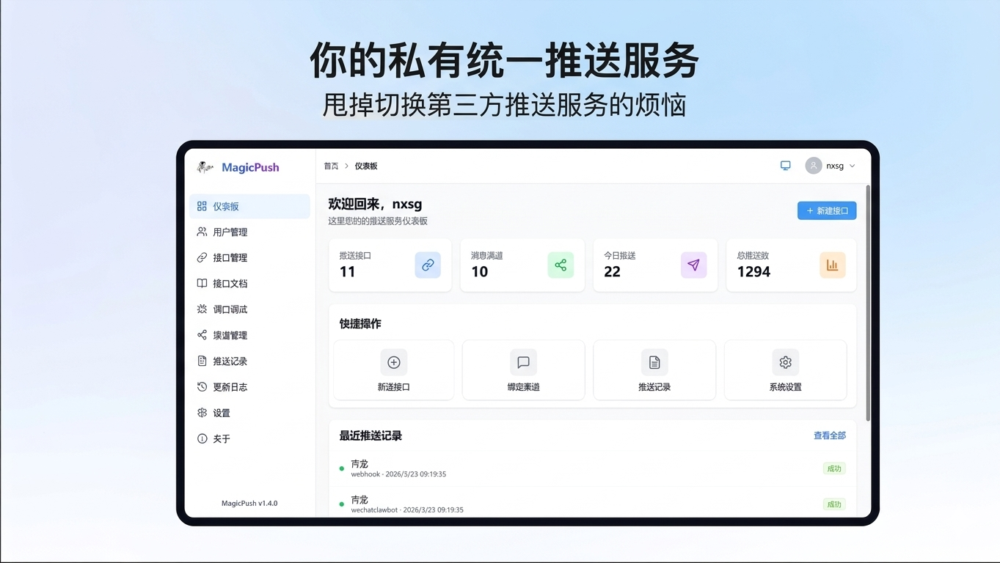
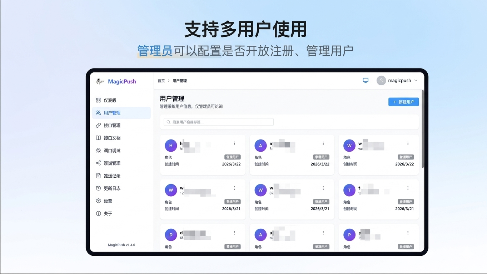
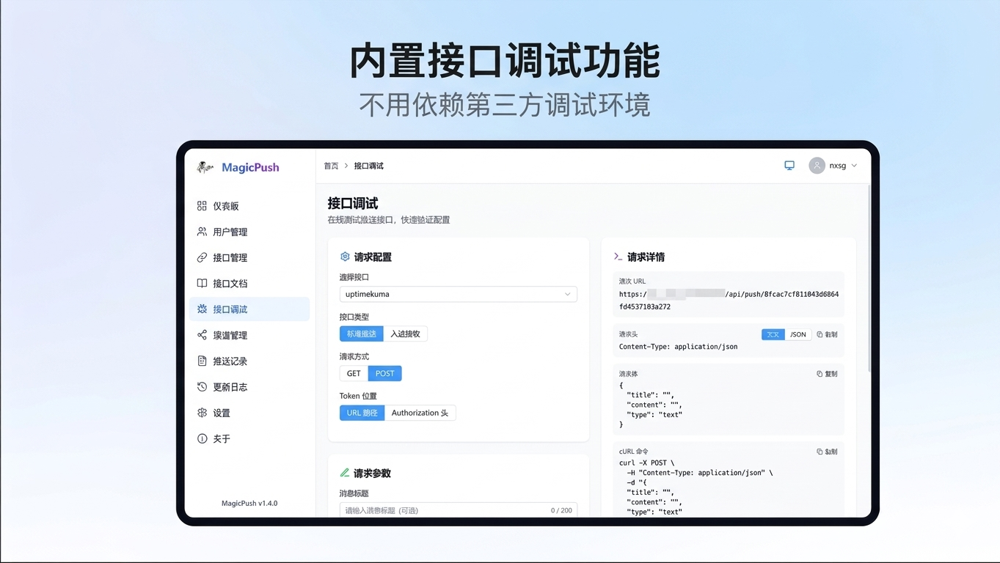
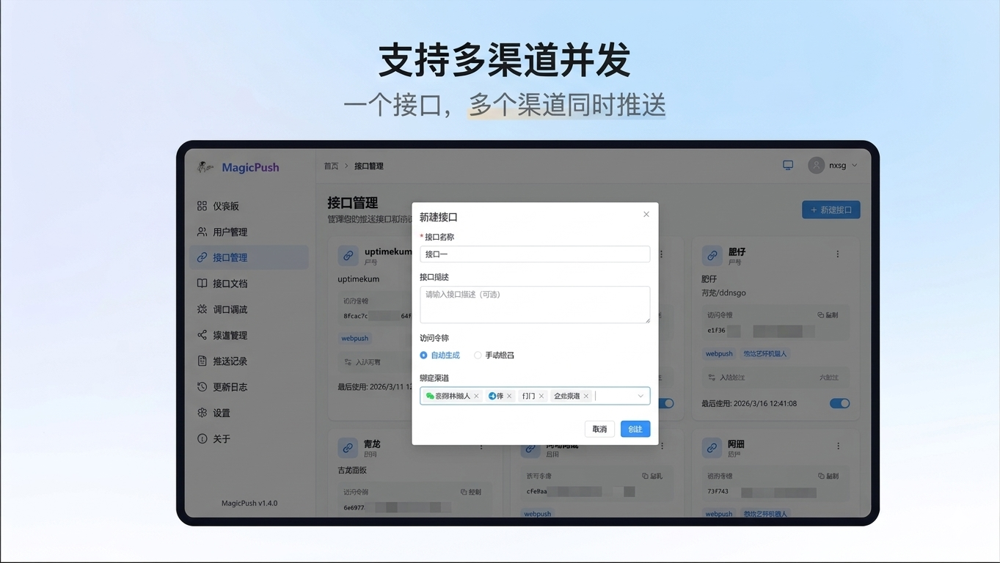
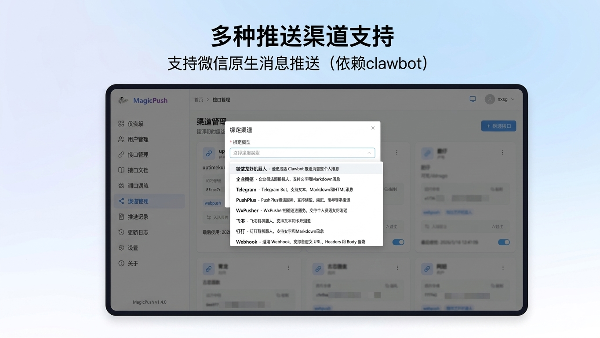
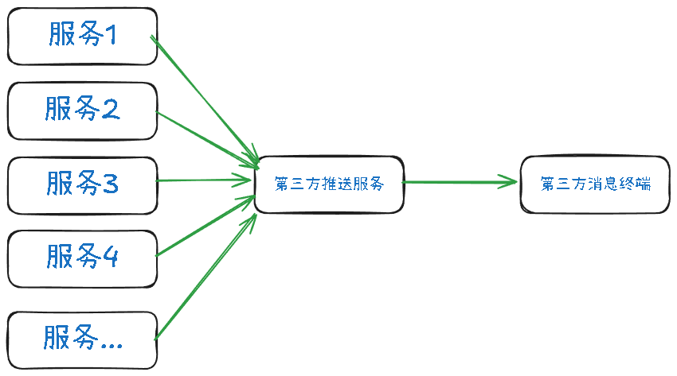
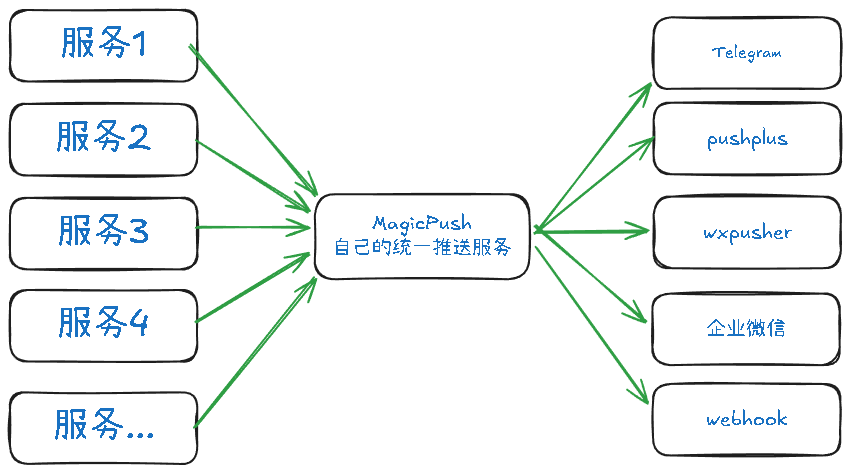

<div align="center">
  
  <h1 align="center">MagicPush</h1> 
  <p>一个支持多种消息渠道的推送服务管理平台，用户可以通过标准化的REST API接口将消息推送到多种通知渠道。</p>
  <p>
    <a href="./LICENSE">
      
    </a>
    <a href="./version.json">
      
    </a>
    <a href="https://hub.docker.com/r/magiccode1412/magicpush" target="_blank">
      
    </a>
    <a href="https://hub.docker.com/r/magiccode1412/magicpush" target="_blank">
      
    </a>
  </p>
</div>


## 项目地址
+ [CNB云原生构建](https://cnb.cool/magiccode1412/magicpush)
+ [GitHub](https://github.com/magiccode1412/magicpush)

## 📝 更新日志
查看 [CHANGELOG.md](docs/CHANGELOG.md) 了解版本更新记录。

## 🌐 [点此跳转到Demo站试用](https://rurvbrlarizv.ap-northeast-1.clawcloudrun.com/)
自行注册即可

> 提示：演示环境仅作测试使用，请勿发送违规信息，数据会定期重置，请勿存储重要信息。

## 预览

<details>
  <summary>点击查看预览图</summary>
  <div>
    
    
    
    
    
    <!-- 
    
    
    
    
    
    
    
    
     -->
  </div>
</details>

## 困境

市面上有很多消息推送服务,但是各个各的局限,例如:
  + Telegram ➡️ 最优秀的消息推送服务,但是需要魔法
  + 企业微信/钉钉/飞书 ➡️ 消息仅限于企业内部
  + 微信服务号 ➡️ 模板消息限制太多
  + 微信龙虾机器人 ➡️ 支持直接推送到个人微信，但有10条/24小时限制

也有一些开发者,开始转向App推送,更甚者,开始支持手机系统底层推送,例如:
+ pushplus: 支持多渠道推送,包括微信服务号/App/webhook
+ wxpusher: 支持多种手机的系统级推送,不需要App运行

其实市面上的推送服务基本都覆盖到了(**除了万恶之首的微信**),但是我们必须考虑如果作为中转的第三方推送服务宕机了,或者说不玩了,会有什么后端,得更新所有的调用代码/令牌

通过以下几张图,就会明白,自己拥有一个推送服务,是多么的有用:
+ 一对一的消息推送方式

+ 多对一推送服务

+ 使用自己的推送服务


## ✨ 功能特性

### 消息渠道支持
- **微信龙虾机器人** (扫码绑定，直接推送到个人微信，有10条/24小时限制)
- 企业微信机器人
- Telegram Bot
- PushPlus
- WxPusher
- 飞书机器人
- 钉钉机器人
- **微信公众号** (模板消息推送，支持测试号)
- **Server酱** (微信推送服务)
- **Webhook** (通用 HTTP 推送，支持自定义 URL/Headers/Body)
- **SMTP邮件** (支持QQ邮箱、163邮箱、Gmail等)
- **Gotify** (开源自托管推送服务)
- **Bark** (iOS 自定义推送通知)
- **Meow** (鸿蒙系统推送应用)
- **企业微信应用** (企业微信应用消息推送)

### 核心功能
- 多渠道消息同时推送
- 标准化REST API
- 双令牌JWT认证机制 (access/refresh token)
- 用户注册/登录
- 渠道绑定与配置管理
- 推送接口管理（多接口/多令牌）
- 推送历史记录与状态追踪
- 响应式Web管理界面
- 深浅色主题切换

### 安全防护
- **三层限流防护**
  - Nginx 层：IP 级请求频率限制 + 并发连接控制（兜底保护）
  - Express 全局：按 IP 限制每分钟总请求数
  - Express 接口级：针对登录、注册、推送、入站等接口独立限流
- **动态限流配置**：管理员可在前端「安全设置」页面实时调整所有限流额度，修改立即生效，无需重启服务
- **推送接口双重限流**：同时按来源 IP 和推送 Token 限流，防止 Token 泄露后被滥用
- 限流触发时自动记录日志，方便排查异常请求

> **注意：** 预构建的 Docker 镜像（`magiccode1412/magicpush:latest`）为 All-in-One 模式（Express 直接提供静态文件），不包含 Nginx，因此仅具备 Express 层的两层限流。如需启用 Nginx 层的兜底限流，请使用 `docker-compose up -d` 自行构建前后端分离镜像。

## ⚠️ 各渠道消息发送频率限制

本项目对各推送接口有默认的限流策略（可在管理后台「安全设置」中动态调整），同时各消息渠道平台自身也有频率限制，配置时需注意：

| 渠道 | 平台频率限制 | 限制维度 | 说明 |
|------|-------------|---------|------|
| **企业微信群机器人** | 20 条/分钟 | 每个 Webhook | 官方文档明确标注，超限返回错误码 |
| **企业微信应用** | ~200 次/分钟 | 每个应用 | 与接收人数相关 |
| **Telegram Bot** | 1 条/秒（同群）<br>30 条/秒（不同群） | 每个群聊 / 全局 | 超限返回 429，需等待 retry-after |
| **PushPlus** | 200 条/天<br>5 次/秒 | 每个 Token | 免费用户限制，会员可提升额度 |
| **WxPusher** | 200 条/天 | 每个 AppToken | 免费限制 |
| **飞书群机器人** | 50 次/分钟 | 每个 Webhook | 自定义机器人限制 |
| **钉钉群机器人** | 20 条/分钟 | 每个机器人每群 | 超限被限流一段时间 |
| **Server酱** | 5 次/秒 | 每个 SendKey | Turbo 版限制 |
| **微信公众号** | 10 万 条/天 | 每个模板 | 认证服务号，测试号同样 10 万/天 |
| **SMTP 邮件** | 因服务商而异 | 每个账号 | QQ 邮箱/163: 约 500/天，Gmail: 约 500/天 |
| **QQ 机器人** | 20 条/秒 | 每个机器人 | 全局限速 |
| **Bark** | 无限制 | - | 自建服务，无平台限制 |
| **Gotify** | 无限制 | - | 自建服务，无平台限制 |
| **Meow** | 无限制 | - | 自建服务，无平台限制 |
| **Webhook** | 无限制 | - | 取决于目标服务器 |
| **微信龙虾机器人** | 10 条/24 小时 | 每个微信号 | 连续发送 10 条后需用户主动发消息才能继续 |
| **企业微信应用** | ~200 次/分钟 | 每个应用 | 与接收人数相关 |

> **提示：** 以上为各平台官方公开的限制信息，具体限制可能随平台政策调整而变化，请以各平台最新文档为准。高频推送场景建议优先选择无平台限制的自建渠道（Bark/Gotify/Webhook）。

## 🐳 Docker 部署

**latest镜像已支持amd/armv8架构**

### 点击下面任一按钮一键部署

[](https://zeabur.com/templates/GGBDF1?referralCode=nixingshiguang)
没有免费资源了

[](https://railway.com/deploy/JbNI4y?referralCode=85Y1W5&utm_medium=integration&utm_source=template&utm_campaign=generic)

+ 先用30天免费试用，5美元积分，然后每月1美元
+ 每个服务最多支持1个vCPU / 0.5GB RAM
+ 0.5 GB 卷存储
+ 无需信用卡

### 使用预构建镜像

**docker命令**

```bash
docker run -d -p 3000:3000 \
  -v $(pwd)/data:/app/server/data \
  magiccode1412/magicpush:latest
```

**docker compose**

```yml
services:
  app:
    image: magiccode1412/magicpush:latest # 国外用这个
    #image: docker.cnb.cool/magiccode1412/magicpush:latest # 国内用这个
    ports:
      - "3000:3000"
    # environment:
      # - JWT_SECRET=your-secret-key # 可选，不设置则自动生成安全密钥
    volumes:
      - ./data:/app/server/data
    network_mode: bridge
    container_name: magicpush
```

访问：http://localhost:3000

### 手动构建

**分离部署前后端**

支持更灵活的配置，这种方法需要**拉取项目自行构建**

```bash
docker-compose up -d
```

**单一镜像**
```bash
docker build -t magicpush .
```

访问：http://localhost:80

## 🛠️ 技术栈

### 后端
- Node.js 18+
- Express.js 4.x
- SQLite3 (better-sqlite3)
- JWT (jsonwebtoken)
- bcryptjs (密码加密)
- express-rate-limit (API 限流)

### 前端
- Vue 3 (Composition API)
- Vite 5.x
- Tailwind CSS 3.x
- Element Plus
- Pinia (状态管理)
- Vue Router 4.x

## 📁 项目结构

```
/workspace/
├── server/              # 后端项目
│   ├── src/
│   │   ├── config/      # 配置文件
│   │   ├── controllers/ # 控制器
│   │   ├── middleware/  # 中间件
│   │   │   └── rateLimit.middleware.js # 限流中间件
│   │   ├── models/      # 数据模型
│   │   ├── routes/      # 路由定义
│   │   ├── services/    # 业务服务
│   │   │   ├── channels/# 渠道适配器
│   │   │   └── rateLimitConfig.service.js # 限流配置服务
│   │   ├── utils/       # 工具函数
│   │   └── database/    # 数据库初始化
│   ├── Dockerfile       # 后端 Dockerfile
│   ├── package.json
│   └── .env
│
├── web/                 # 前端项目
│   ├── src/
│   │   ├── api/         # API接口
│   │   ├── components/  # 组件
│   │   ├── router/      # 路由
│   │   ├── stores/      # 状态管理
│   │   ├── views/       # 页面视图
│   │   │   └── settings/ # 设置页面（含安全设置）
│   │   └── styles/      # 样式文件
│   ├── Dockerfile       # 前端 Dockerfile
│   ├── nginx.conf       # 前端 nginx 配置
│   ├── index.html       # 入口 HTML
│   ├── vite.config.js   # Vite 配置
│   ├── tailwind.config.js # Tailwind 配置
│   ├── package.json
│   └── .env
│
├── scripts/             # 脚本目录
│   ├── start.sh         # 本地开发启动脚本
│   ├── start-docker.sh  # Docker 容器内启动脚本
│   ├── docker.sh        # Docker 镜像构建推送脚本
│   └── version.js       # 版本管理脚本
│
├── docs/                # 文档目录
├── public/              # 静态资源（演示图片）
├── Dockerfile           # All-in-One Dockerfile（Express 提供静态文件）
├── docker-compose.yml   # Docker Compose 配置（前后端分离）
└── version.json         # 版本配置
```

## 🚀 快速开始

### 环境要求
- Node.js >= 18.0.0
- npm >= 9.0.0

### 安装依赖

```bash
# 后端依赖
cd server
npm install

# 前端依赖
cd web
npm install
```

### 初始化数据库

```bash
cd server
npm run init-db
```

### 启动服务

```bash
# 使用启动脚本（同时启动前后端）
bash ./scripts/start.sh

# 或分别启动
# 后端
cd server && npm start

# 前端（新终端）
cd web && npm run dev
```

访问地址：
- 前端界面: http://localhost:5173
- 后端API: http://localhost:3000

## 📖 API 使用说明

### 推送消息

支持多种调用方式：

#### 方式1: Token 在 URL 路径中 (GET/POST)

```bash
# GET 请求（适合简单测试）
curl "http://localhost:3000/api/push/{your_token}?title=标题&content=内容&type=text"

# POST 请求
curl -X POST http://localhost:3000/api/push/{your_token} \
  -H "Content-Type: application/json" \
  -d '{
    "title": "消息标题",
    "content": "消息内容",
    "type": "text"
  }'
```

#### 方式2: Token 在 Authorization 头中 (POST) - 推荐

更安全的方式，Token 不会暴露在 URL 中

```bash
curl -X POST http://localhost:3000/api/push \
  -H "Authorization: Bearer {your_token}" \
  -H "Content-Type: application/json" \
  -d '{
    "title": "消息标题",
    "content": "消息内容",
    "type": "text"
  }'
```

**参数说明：**
| 字段 | 类型 | 必填 | 说明 |
|------|------|------|------|
| title | string | 否 | 消息标题 |
| content | string | 是 | 消息内容 |
| type | string | 否 | 消息类型: text/markdown/html，默认 text |

### 认证流程

1. 注册/登录获取 accessToken 和 refreshToken
2. 在请求头中携带: `Authorization: Bearer {accessToken}`
3. 当 accessToken 过期时，使用 refreshToken 换取新的令牌

### 支持的渠道配置

| 渠道 | 必需配置 |
|------|---------|
| 微信龙虾机器人 | 扫码绑定 (自动获取配置) |
| 企业微信 | key (机器人Key) |
| Telegram | botToken, chatId |
| PushPlus | token (可选: topic) |
| WxPusher | appToken (可选: uids, topicIds) |
| 飞书 | webhookUrl (可选: secret) |
| 钉钉 | webhookUrl (可选: secret) |
| 微信公众号 | appId, appSecret, templateId, openIds (多个用逗号分隔) |
| Server酱 | sendKey (可选: channel) |
| Webhook | url, method (可选: headers, bodyTemplate) |
| SMTP邮件 | host, port, user, pass, to (可选: secure, from) |
| Gotify | serverUrl, token (可选: priority) |
| Bark | serverUrl, deviceKey (可选: group, sound, level, icon) |
| Meow | nickname (可选: type) |
| 企业微信应用 | corpid, corpsecret, agentid, touser (可选: type) |

> **微信龙虾机器人限制说明：** 机器人连续主动发送 10 条消息后，需用户主动发送一条消息才能继续推送；自用户上次主动发消息起 24 小时后，也需主动发消息才能继续推送。系统会在接近限额时自动在消息中提醒用户。

## 🔐 环境变量

后端 `.env` 配置：

```env
NODE_ENV=development
# JWT_SECRET=your-secret-key        # 可选，不设置则自动生成安全密钥
JWT_ACCESS_EXPIRES_IN=15m           # 可选，默认 15 分钟
JWT_REFRESH_EXPIRES_IN=7d           # 可选，默认 7 天
DB_PATH=./data/push_service.db      # 可选
LOG_LEVEL=info                      # 可选，默认 info
```

## 📝 开发说明

### 添加新的消息渠道

1. 在 `server/src/services/channels/` 创建新的适配器类
2. 继承 `BaseChannel` 基类
3. 实现 `send()`, `validate()`, `test()` 方法
4. 在 `index.js` 中注册新渠道

### 添加入站配置数据来源模板

在 `server/src/utils/jsonpath.js` 的 `PRESET_TEMPLATES` 对象中添加新模板：

```javascript
const PRESET_TEMPLATES = {
  // 现有模板...
  
  // 添加新模板
  jenkins: {
    name: 'Jenkins',                    // 显示名称
    description: 'Jenkins 构建通知',     // 描述文字
    fieldMapping: {
      title: '$.name',                  // 标题的 JSONPath 表达式
      content: '$.build.full_url',      // 内容的 JSONPath 表达式
    },
    defaultValues: {
      type: 'text',                     // 消息类型: text/markdown/html
    },
  },
};
```

**模板字段说明：**

| 字段 | 类型 | 说明 |
|------|------|------|
| `name` | string | 显示名称 |
| `description` | string | 描述文字 |
| `fieldMapping.title` | string | 标题的 JSONPath 表达式 |
| `fieldMapping.content` | string | 内容的 JSONPath 表达式 |
| `defaultValues.type` | string | 消息类型：`text` / `markdown` / `html` |

前端通过 API 自动获取模板列表，无需修改前端代码。

### 数据库表结构

- `users` - 用户信息
- `channels` - 渠道配置
- `endpoints` - 推送接口
- `endpoint_channels` - 接口-渠道关联
- `push_logs` - 推送记录
- `refresh_tokens` - 刷新令牌
- `system_settings` - 系统设置（如注册开关）

## 🐛 故障排除

### 常见问题

1. **端口被占用**
   - 后端固定使用 `3000` 端口
   - 修改 `web/vite.config.js` 中的 `server.port` 可更改前端开发端口

2. **数据库权限错误**
   - 确保 `server/data/` 目录有写入权限
   - 或修改 `DB_PATH` 到其他有权限的位置

3. **CORS 错误**
   - 检查 `server/src/app.js` 中的 CORS 配置
   - 生产环境确保设置了正确的 `FRONTEND_URL`

## 感谢

- [tt-haogege](（https://github.com/tt-haogege)的[pr](https://github.com/magiccode1412/magicpush/pull/2)提供UI灵感

## 📄 许可证

MIT License
